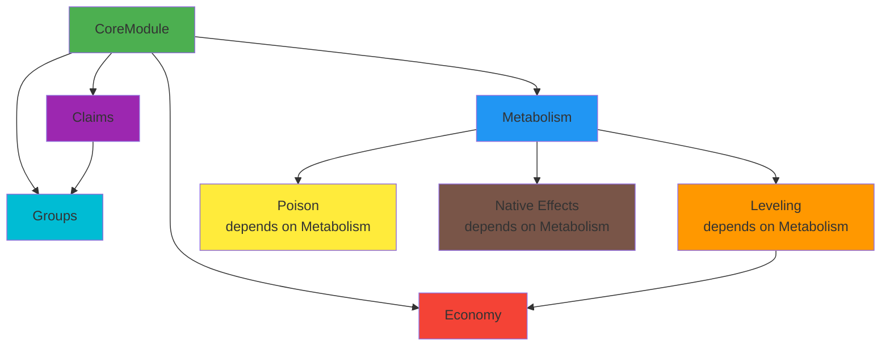

# Living Lands - Module Architecture Analysis

**Date:** 2026-01-25  
**Purpose:** Analyze existing modules, identify patterns, and propose standardization for future modules

---

## Current Module Status

### ✅ Fully Implemented Modules

| Module | Status | Lines of Code | Core Integration | Notes |
|--------|--------|---------------|------------------|-------|
| **Metabolism** | Complete | ~2,500 LOC | Full | Hunger, thirst, energy tracking with buffs/debuffs |

### 📋 Planned Modules (Post-MVP)

| Module | Priority | Estimated Complexity | Dependencies |
|--------|----------|---------------------|--------------|
| **Leveling** | High | Medium | Metabolism (for XP from actions) |
| **Claims** | High | Medium | None (standalone) |
| **Economy** | Medium | Low | Leveling (optional) |
| **Groups** | Medium | Low | None (standalone) |
| **Poison** | Low | Low | Metabolism (stat effects) |
| **Native Effects** | Low | Medium | Hytale effect system |

---

## Core Module Usage Analysis

### What Metabolism Module Uses from Core

```kotlin
// ✅ CoreModule.services - Service Registry
CoreModule.services.register<MetabolismService>(metabolismService)
val service = CoreModule.services.get<MetabolismService>()

// ✅ CoreModule.config - Configuration Management
metabolismConfig = CoreModule.config.loadWithMigration(
    MetabolismConfig.MODULE_ID,
    MetabolismConfig(),
    MetabolismConfig.CURRENT_VERSION
)

// ✅ CoreModule.config - Reload Callbacks
CoreModule.config.onReload("metabolism") { onConfigReloaded() }

// ✅ CoreModule.config - Migration Registration
CoreModule.config.registerMigrations(
    MetabolismConfig.MODULE_ID,
    MetabolismConfig.getMigrations()
)

// ✅ CoreModule.worlds - World Management
val worldContext = CoreModule.worlds.getContext(session.worldId)
worldContext.getData<MetabolismRepository> { MetabolismRepository(...) }

// ✅ CoreModule.players - Player Session Tracking
val session = CoreModule.players.getSession(playerId)
session.world.execute { /* ECS thread-safe access */ }

// ✅ CoreModule.hud - MultiHUD Management
CoreModule.hud.setHud(playerRef, "livinglands:metabolism", hudElement)
CoreModule.hud.removeHud(playerRef, "livinglands:metabolism")

// ✅ CoreModule.isDebug() - Debug Mode Flag
if (CoreModule.isDebug()) {
    logger.atFine().log("Debug info")
}

// ⚠️ NOT USED: CoreModule.commands - Command registration (uses AbstractModule.registerCommand instead)
```

### Module Lifecycle Hooks (from AbstractModule)

```kotlin
// Called by CoreModule during plugin lifecycle
override suspend fun onSetup() { /* Load config, initialize services */ }
override suspend fun onStart() { /* Start tick systems, register events */ }
override suspend fun onShutdown() { /* Cleanup resources */ }

// Called by CoreModule when players join/leave
override suspend fun onPlayerJoin(playerId: UUID, session: PlayerSession) { /* Initialize player data */ }
override suspend fun onPlayerDisconnect(playerId: UUID, session: PlayerSession) { /* Save and cleanup */ }
```

---

## Patterns & Best Practices from Metabolism Module

### 1. **Configuration Pattern**
```kotlin
// Module config with versioning and migration
data class ModuleConfig(
    override val configVersion: Int = CURRENT_VERSION,
    val enabled: Boolean = true,
    // ... module-specific settings
) : VersionedConfig {
    companion object {
        const val CURRENT_VERSION = 2
        const val MODULE_ID = "module_name"
        
        fun getMigrations(): List<ConfigMigration> = listOf(/* migrations */)
    }
}
```

**✅ Standardized Across All Modules**

### 2. **Persistence Pattern**
```kotlin
// Module-specific repository
class ModuleRepository(
    private val persistence: PersistenceService,
    private val logger: HytaleLogger
) : Repository<DataClass, UUID> {
    
    suspend fun initialize() {
        persistence.execute(/* CREATE TABLE */)
    }
    
    override suspend fun save(entity: DataClass) { /* ... */ }
    override suspend fun findById(id: UUID): DataClass? { /* ... */ }
}

// Store in WorldContext
worldContext.getData { ModuleRepository(persistence, logger) }
```

**✅ Standardized Pattern** - All modules should use Repository pattern

### 3. **Service Pattern**
```kotlin
// Module service (business logic)
class ModuleService(
    private val config: ModuleConfig,
    private val logger: HytaleLogger
) {
    // Business logic methods
    fun doSomething() { /* ... */ }
}

// Register with CoreModule
CoreModule.services.register<ModuleService>(moduleService)
```

**✅ Standardized** - Service registry for cross-module communication

### 4. **ECS Tick System Pattern**
```kotlin
class ModuleTickSystem(
    private val moduleService: ModuleService,
    private val logger: HytaleLogger
) : EntityTickingSystem<EntityStore>() {
    
    override fun getQuery(): Query<EntityStore> {
        return Player.getComponentType()
    }
    
    override fun tick(deltaTime: Float, index: Int, chunk: ArchetypeChunk<EntityStore>, 
                     store: Store<EntityStore>, commandBuffer: CommandBuffer<EntityStore>) {
        val ref = chunk.getReferenceTo(index)
        val player = store.getComponent(ref, Player.getComponentType()) ?: return
        
        // Process on ECS thread (already safe here)
        moduleService.processTick(player)
    }
}
```

**✅ Standardized** - All per-player tick systems follow this pattern

### 5. **HUD Pattern**
```kotlin
// Create HUD element
class ModuleHudElement(playerRef: PlayerRef) : CustomUIHud(
    playerRef,
    "ui/ModuleHud.ui"  // UI file in resources
)

// Register in onPlayerJoin
CoreModule.hud.setHud(playerRef, "livinglands:module", hudElement)

// Cleanup in onPlayerDisconnect
CoreModule.hud.removeHud(playerRef, "livinglands:module")
```

**✅ Standardized** - MultiHUD system for all HUD elements

### 6. **Player State Caching Pattern**
```kotlin
// Thread-safe cache for frequently accessed player data
private val playerStates = ConcurrentHashMap<UUID, PlayerState>()

fun getState(playerId: UUID): PlayerState? = playerStates[playerId]

fun cachePlayer(playerId: UUID, state: PlayerState) {
    playerStates[playerId] = state
}

fun removeFromCache(playerId: UUID) {
    playerStates.remove(playerId)
}
```

**✅ Standardized** - Use ConcurrentHashMap for thread-safe caching

---

## Areas for Improvement & Standardization

### 1. **Command Registration Inconsistency**
```kotlin
// ❌ Current: Commands register themselves
class ReloadCommand : CommandBase("ll reload", "...", true) {
    override fun executeSync(ctx: CommandContext) { /* ... */ }
}

// In module:
registerCommand(ReloadCommand())  // Uses AbstractModule.registerCommand

// ❓ Problem: Commands are scattered, no central registry
```

**💡 Proposed Improvement:**
```kotlin
// ✅ Better: Centralized command manager in CoreModule
object CommandManager {
    private val commands = ConcurrentHashMap<String, CommandBase>()
    
    fun register(command: CommandBase) { /* ... */ }
    fun unregister(name: String) { /* ... */ }
    fun getCommand(name: String): CommandBase? { /* ... */ }
}

// Modules still use AbstractModule.registerCommand, but it delegates to CommandManager
```

### 2. **Missing Module Dependency System**
```kotlin
// ❌ Current: No formal dependency declaration
class LevelingModule : AbstractModule(
    id = "leveling",
    name = "Leveling",
    version = "1.0.0",
    dependencies = emptySet()  // ⚠️ But actually depends on Metabolism for XP!
)

// ❓ Problem: No validation, modules might load in wrong order
```

**💡 Proposed Improvement:**
```kotlin
// ✅ Better: Declare dependencies, CoreModule validates order
class LevelingModule : AbstractModule(
    id = "leveling",
    name = "Leveling",
    version = "1.0.0",
    dependencies = setOf("metabolism")  // Formal dependency
)

// CoreModule.loadModules() topologically sorts by dependencies
```

### 3. **No Standard Event Bus Pattern**
```kotlin
// ❌ Current: Modules directly access services
val metabolismService = CoreModule.services.get<MetabolismService>()
metabolismService.restoreStats(playerId, hunger, thirst, energy)

// ❓ Problem: Tight coupling, circular dependencies possible
```

**💡 Proposed Improvement:**
```kotlin
// ✅ Better: Event bus for loose coupling
sealed class LivingLandsEvent {
    data class StatsRestored(val playerId: UUID, val hunger: Float, val thirst: Float, val energy: Float) : LivingLandsEvent()
    data class XPGained(val playerId: UUID, val amount: Int, val profession: String) : LivingLandsEvent()
}

// Modules subscribe to events
CoreModule.events.subscribe<StatsRestored> { event ->
    // Leveling module grants XP when player eats food
}
```

### 4. **Missing Module Health Checks**
```kotlin
// ❌ Current: No way to check module status
// ❓ Problem: Can't diagnose issues or show module status

// ✅ Proposed: Health check system
interface ModuleHealth {
    fun getStatus(): ModuleStatus
    fun getDiagnostics(): Map<String, Any>
}

enum class ModuleStatus {
    HEALTHY,      // All systems operational
    DEGRADED,     // Partial functionality
    UNHEALTHY,    // Critical issues
    STOPPED       // Not running
}

// Add to AbstractModule
override fun getStatus(): ModuleStatus {
    return if (enabled && service != null) ModuleStatus.HEALTHY else ModuleStatus.STOPPED
}
```

### 5. **No Standard Metrics/Stats Collection**
```kotlin
// ❌ Current: No performance metrics
// ❓ Problem: Can't identify bottlenecks

// ✅ Proposed: Module metrics
data class ModuleMetrics(
    val tickDurationMs: Long,
    val playersProcessed: Int,
    val errorsCount: Int,
    val databaseQueriesCount: Int
)

// Modules report metrics
CoreModule.metrics.record(moduleId, metrics)

// View with command
// /ll metrics metabolism
```

---

## Proposed Standard Module Template

```kotlin
/**
 * Standard module template following Living Lands best practices.
 * 
 * Replace "Example" with your module name.
 */

// 1. Module Entry Point
class ExampleModule : AbstractModule(
    id = "example",
    name = "Example",
    version = "1.0.0",
    dependencies = emptySet()  // Or setOf("metabolism", "leveling")
) {
    
    // Module-specific fields
    private lateinit var config: ExampleConfig
    private lateinit var service: ExampleService
    private lateinit var repository: ExampleRepository
    
    // Player state cache
    private val playerStates = ConcurrentHashMap<UUID, ExamplePlayerState>()
    
    override suspend fun onSetup() {
        logger.atInfo().log("Example module setting up...")
        
        // 1. Register migrations
        CoreModule.config.registerMigrations(
            ExampleConfig.MODULE_ID,
            ExampleConfig.getMigrations()
        )
        
        // 2. Load configuration
        config = CoreModule.config.loadWithMigration(
            ExampleConfig.MODULE_ID,
            ExampleConfig(),
            ExampleConfig.CURRENT_VERSION
        )
        
        // 3. Create service
        service = ExampleService(config, logger)
        
        // 4. Register service
        CoreModule.services.register<ExampleService>(service)
        
        // 5. Initialize repositories for existing worlds
        initializeRepositories()
        
        // 6. Register tick systems
        if (config.enabled) {
            val tickSystem = ExampleTickSystem(service, logger)
            registerSystem(tickSystem)
        }
        
        // 7. Register commands
        registerCommand(ExampleCommand(service))
        
        // 8. Register config reload callback
        CoreModule.config.onReload("example") {
            onConfigReloaded()
        }
        
        logger.atInfo().log("Example module setup complete")
    }
    
    override suspend fun onStart() {
        logger.atInfo().log("Example module started")
        initializeOnlinePlayers()
    }
    
    override suspend fun onPlayerJoin(playerId: UUID, session: PlayerSession) {
        val worldContext = CoreModule.worlds.getContext(session.worldId) ?: return
        
        // Ensure repository exists
        if (!worldContext.hasData<ExampleRepository>()) {
            repository = ExampleRepository(worldContext.persistence, logger)
            runBlocking { repository.initialize() }
            worldContext.getData { repository }
        }
        
        // Load player data
        val playerData = runBlocking { 
            repository.findById(playerId) ?: ExamplePlayerData(playerId)
        }
        
        // Cache player state
        playerStates[playerId] = ExamplePlayerState(playerData)
        
        // Register HUD if needed
        session.world.execute {
            val player = session.store.getComponent(session.entityRef, Player.getComponentType()) ?: return@execute
            @Suppress("DEPRECATION")
            val playerRef = player.playerRef ?: return@execute
            
            val hudElement = ExampleHudElement(playerRef)
            CoreModule.hud.setHud(playerRef, "livinglands:example", hudElement)
        }
    }
    
    override suspend fun onPlayerDisconnect(playerId: UUID, session: PlayerSession) {
        val worldContext = CoreModule.worlds.getContext(session.worldId) ?: return
        
        // Save player data
        val state = playerStates[playerId]
        if (state != null) {
            runBlocking {
                repository.save(state.toData())
            }
        }
        
        // Cleanup
        playerStates.remove(playerId)
        
        // Remove HUD
        session.world.execute {
            val player = session.store.getComponent(session.entityRef, Player.getComponentType()) ?: return@execute
            @Suppress("DEPRECATION")
            val playerRef = player.playerRef ?: return@execute
            
            CoreModule.hud.removeHud(playerRef, "livinglands:example")
        }
    }
    
    override suspend fun onShutdown() {
        logger.atInfo().log("Example module shutting down...")
        
        // Save all player data
        playerStates.forEach { (playerId, state) ->
            // Find world context and save
        }
        
        playerStates.clear()
        
        logger.atInfo().log("Example module shutdown complete")
    }
    
    private suspend fun initializeRepositories() {
        CoreModule.worlds.getAllContexts().forEach { worldContext ->
            if (!worldContext.hasData<ExampleRepository>()) {
                repository = ExampleRepository(worldContext.persistence, logger)
                repository.initialize()
                worldContext.getData { repository }
            }
        }
    }
    
    private suspend fun initializeOnlinePlayers() {
        CoreModule.players.getAllSessions().forEach { (playerId, session) ->
            onPlayerJoin(playerId, session)
        }
    }
    
    private fun onConfigReloaded() {
        config = CoreModule.config.load("example", ExampleConfig())
        logger.atInfo().log("Example config reloaded")
    }
}

// 2. Configuration
data class ExampleConfig(
    override val configVersion: Int = CURRENT_VERSION,
    val enabled: Boolean = true,
    // Module-specific config
    val exampleSetting: Int = 100
) : VersionedConfig {
    
    constructor() : this(configVersion = CURRENT_VERSION)
    
    companion object {
        const val CURRENT_VERSION = 1
        const val MODULE_ID = "example"
        
        fun getMigrations(): List<ConfigMigration> = emptyList()
    }
}

// 3. Data Layer
data class ExamplePlayerData(
    val playerId: UUID,
    val exampleValue: Int = 0
)

data class ExamplePlayerState(
    val data: ExamplePlayerData
) {
    fun toData() = data
}

class ExampleRepository(
    private val persistence: PersistenceService,
    private val logger: HytaleLogger
) : Repository<ExamplePlayerData, UUID> {
    
    suspend fun initialize() {
        persistence.execute("""
            CREATE TABLE IF NOT EXISTS example_data (
                player_id TEXT PRIMARY KEY,
                example_value INTEGER NOT NULL DEFAULT 0
            )
        """)
    }
    
    override suspend fun save(entity: ExamplePlayerData) {
        persistence.execute("""
            INSERT OR REPLACE INTO example_data (player_id, example_value)
            VALUES (?, ?)
        """, entity.playerId.toString(), entity.exampleValue)
    }
    
    override suspend fun findById(id: UUID): ExamplePlayerData? {
        return persistence.query(
            "SELECT * FROM example_data WHERE player_id = ?",
            id.toString()
        ) { rs ->
            if (rs.next()) {
                ExamplePlayerData(
                    playerId = UUID.fromString(rs.getString("player_id")),
                    exampleValue = rs.getInt("example_value")
                )
            } else null
        }
    }
    
    override suspend fun delete(id: UUID) {
        persistence.execute("DELETE FROM example_data WHERE player_id = ?", id.toString())
    }
    
    override suspend fun existsById(id: UUID): Boolean {
        return findById(id) != null
    }
    
    override suspend fun findAll(): List<ExamplePlayerData> {
        return persistence.query("SELECT * FROM example_data") { rs ->
            val results = mutableListOf<ExamplePlayerData>()
            while (rs.next()) {
                results.add(ExamplePlayerData(
                    playerId = UUID.fromString(rs.getString("player_id")),
                    exampleValue = rs.getInt("example_value")
                ))
            }
            results
        } ?: emptyList()
    }
    
    override suspend fun count(): Long {
        return persistence.query("SELECT COUNT(*) as count FROM example_data") { rs ->
            if (rs.next()) rs.getLong("count") else 0L
        } ?: 0L
    }
}

// 4. Service Layer
class ExampleService(
    private val config: ExampleConfig,
    private val logger: HytaleLogger
) {
    fun doSomething(playerId: UUID) {
        if (!config.enabled) return
        logger.atFine().log("Doing something for player $playerId")
    }
}

// 5. Tick System
class ExampleTickSystem(
    private val service: ExampleService,
    private val logger: HytaleLogger
) : EntityTickingSystem<EntityStore>() {
    
    override fun getQuery(): Query<EntityStore> {
        return Player.getComponentType()
    }
    
    override fun tick(
        deltaTime: Float,
        index: Int,
        chunk: ArchetypeChunk<EntityStore>,
        store: Store<EntityStore>,
        commandBuffer: CommandBuffer<EntityStore>
    ) {
        val ref = chunk.getReferenceTo(index)
        val player = store.getComponent(ref, Player.getComponentType()) ?: return
        
        @Suppress("DEPRECATION")
        val playerId = player.getUuid() ?: return
        
        service.doSomething(playerId)
    }
}

// 6. HUD Element (STANDARDIZED PATTERN - v1.0.2+)
class ExampleHudElement(playerRef: PlayerRef) : CustomUIHud(playerRef) {
    
    @Volatile private var currentValue: Int = 0
    
    override fun build(builder: UICommandBuilder) {
        builder.append("Hud/ExampleHud.ui")
        builder.set("#ExampleValue.Text", currentValue.toString())
    }
    
    fun updateValue(value: Int) {
        currentValue = value
    }
    
    fun updateHud() {
        val builder = UICommandBuilder()
        builder.set("#ExampleValue.Text", currentValue.toString())
        update(false, builder)
    }
    
    companion object {
        const val NAMESPACE = "livinglands:example"
    }
}

// Module Registration (CRITICAL: Use MultiHudManager, NOT direct setCustomHud)
override suspend fun onPlayerJoin(playerId: UUID, session: PlayerSession) {
    session.world.execute {
        val player = session.store.getComponent(session.entityRef, Player.getComponentType()) ?: return@execute
        @Suppress("DEPRECATION")
        val playerRef = player.playerRef ?: return@execute
        
        val hudElement = ExampleHudElement(playerRef)
        // ✅ CORRECT: Register via MultiHudManager
        CoreModule.hudManager.setHud(player, playerRef, ExampleHudElement.NAMESPACE, hudElement)
        
        // ❌ WRONG: Do NOT call player.hudManager.setCustomHud() directly!
        // This bypasses the composite system and breaks multi-module support
    }
}

// Service Update Pattern (Get HUD from MultiHudManager)
class ExampleService {
    fun updateSomething(playerId: UUID, value: Int) {
        // ✅ OPTION 1: Get HUD and update manually
        val hudElement = CoreModule.hudManager.getHud<ExampleHudElement>(
            playerId,
            ExampleHudElement.NAMESPACE
        )
        hudElement?.updateValue(value)
        hudElement?.updateHud()
        
        // ✅ OPTION 2: Use helper method (recommended)
        CoreModule.hudManager.updateHud<ExampleHudElement>(playerId, ExampleHudElement.NAMESPACE) { hud ->
            hud.updateValue(value)
            hud.updateHud()
        }
    }
}

// 7. Command
class ExampleCommand(
    private val service: ExampleService
) : CommandBase("example", "Example command", false) {
    
    override fun executeSync(ctx: CommandContext) {
        val player = ctx.sender as? Player ?: return
        @Suppress("DEPRECATION")
        val playerId = player.getUuid() ?: return
        
        service.doSomething(playerId)
        ctx.sendMessage(Message.raw("Example command executed!"))
    }
}
```

---

## Checklist for New Modules

When creating a new module, ensure it follows these standards:

### Configuration
- [ ] Implements `VersionedConfig` interface
- [ ] Has `configVersion` field with `CURRENT_VERSION` constant
- [ ] Has `MODULE_ID` constant
- [ ] Provides `getMigrations()` function
- [ ] Registers migrations in `onSetup()`
- [ ] Loads config with `CoreModule.config.loadWithMigration()`
- [ ] Registers reload callback with `CoreModule.config.onReload()`

### Persistence
- [ ] Has module-specific `Repository` class implementing `Repository<T, UUID>`
- [ ] Initializes tables in `repository.initialize()`
- [ ] Uses `PersistenceService` for all DB access
- [ ] Stores repository in `WorldContext` via `worldContext.getData<T> { }`
- [ ] Async operations use `suspend` functions with `Dispatchers.IO`

### Service Registry
- [ ] Creates module service class
- [ ] Registers service with `CoreModule.services.register<T>()`
- [ ] Other modules access via `CoreModule.services.get<T>()`

### Player Lifecycle
- [ ] Implements `onPlayerJoin()` to load player data
- [ ] Implements `onPlayerDisconnect()` to save player data
- [ ] Uses `ConcurrentHashMap` for player state caching
- [ ] Cleans up state in `onPlayerDisconnect()`

### World Management
- [ ] Accesses world context via `CoreModule.worlds.getContext(worldId)`
- [ ] Initializes repositories for existing worlds in `initializeRepositories()`
- [ ] Handles world addition/removal gracefully

### ECS & Threading
- [ ] All ECS access wrapped in `world.execute { }`
- [ ] Tick systems extend `EntityTickingSystem<EntityStore>`
- [ ] Uses `ConcurrentHashMap` for shared state
- [ ] Async DB operations use coroutines

### HUD (if applicable) - UPDATED v1.0.2
- [ ] Extends `CustomUIHud` with `override fun build(builder: UICommandBuilder)`
- [ ] Has `companion object` with `NAMESPACE` constant
- [ ] Stores state in `@Volatile` fields (not in service/module)
- [ ] **CRITICAL:** Registers with `CoreModule.hudManager.setHud()` (NOT `player.hudManager.setCustomHud()`)
- [ ] Service updates via `CoreModule.hudManager.updateHud<T>()` helper (recommended)
- [ ] OR get HUD via `CoreModule.hudManager.getHud<T>()` for manual updates
- [ ] Removes with `CoreModule.hudManager.removeHud()` on disconnect
- [ ] Calls `CoreModule.hudManager.onPlayerDisconnect()` after removal
- [ ] UI file created in `src/main/resources/Hud/` (note capital H)
- [ ] **DO NOT** store HUD references in service or module (MultiHudManager is single source of truth)

### Commands (if applicable)
- [ ] Extends `CommandBase`
- [ ] Registers with `registerCommand()` in `onSetup()`
- [ ] Uses `CommandContext` for messages
- [ ] Checks permissions appropriately

### Logging
- [ ] Uses `logger.atInfo()` for important events
- [ ] Uses `logger.atFine()` for debug info (only when `CoreModule.isDebug()`)
- [ ] Uses `logger.atWarning()` for errors
- [ ] Never uses `println()` or `System.out`

### Error Handling
- [ ] Try-catch blocks in tick systems
- [ ] Graceful degradation (log errors, continue operation)
- [ ] No crashes from module failures

---

## Module Dependency Graph (Proposed)



---

## Recommendations

### Immediate (Before Next Module)

1. **Create `ExampleModule`** as a reference implementation using the template above
2. **Document Core Module APIs** in `docs/CORE_API.md`
3. **Add module dependency validation** to `CoreModule.loadModules()`
4. **Create module generator script** that scaffolds new modules from template

### Short-Term (During Leveling/Claims Development)

5. **Implement event bus** for loose coupling between modules
6. **Add module health checks** and `/ll status` command
7. **Create module metrics system** for performance monitoring
8. **Standardize command registration** through `CommandManager`

### Long-Term (Post-MVP)

9. **Module marketplace** - Load modules dynamically from external JARs
10. **Module hot-reload** - Reload modules without server restart
11. **Module API versioning** - Handle breaking changes between module versions
12. **Module testing framework** - Integration tests for module interactions

---

## Inter-Module Communication Patterns

### Overview of Mock Modules

We've created mock implementations of four planned modules to validate architecture patterns:

| Module | Status | Dependencies | Communication Needs |
|--------|--------|--------------|---------------------|
| **Leveling** | Mock | None (Metabolism optional) | Receives: Food consumption events<br/>Emits: Level-up events |
| **Claims** | Mock | None | Receives: Block break/place events<br/>Provides: Build permission checks |
| **Economy** | Mock | None (Leveling optional) | Receives: Level-up events<br/>Provides: Balance queries, transactions |
| **Groups** | Mock | None (Claims/Economy optional) | Receives: Player chat events<br/>Provides: Group membership queries |

### Pattern 1: Service Registry Communication (Synchronous)

**Use Case:** Module B needs to query or modify Module A's data immediately.

**Example:** Claims module checking if a player can build:

```kotlin
// In GroupsModule - Query membership
class GroupsService {
    fun isInGroup(playerId: UUID, groupId: UUID): Boolean { /* ... */ }
    fun getPlayerGroup(playerId: UUID): UUID? { /* ... */ }
}

// Register service
CoreModule.services.register<GroupsService>(groupsService)

// In ClaimsModule - Use groups service
class ClaimsService {
    private val groupsService = CoreModule.services.get<GroupsService>()
    
    fun canBuild(playerId: UUID, position: Position): Boolean {
        val claim = findClaimAt(position) ?: return true  // Unclaimed = allowed
        
        // Owner can always build
        if (claim.owner == playerId) return true
        
        // Trusted players can build
        if (claim.trustedPlayers.contains(playerId)) return true
        
        // Check if player is in owner's group (if groups module loaded)
        if (groupsService != null) {
            val playerGroup = groupsService.getPlayerGroup(playerId)
            val ownerGroup = groupsService.getPlayerGroup(claim.owner)
            if (playerGroup != null && playerGroup == ownerGroup) {
                return true  // Same group = allowed
            }
        }
        
        return false  // Not allowed
    }
}
```

**Advantages:**
- ✅ Simple and direct
- ✅ Type-safe
- ✅ No additional infrastructure needed

**Disadvantages:**
- ⚠️ Tight coupling (hard dependency on service interface)
- ⚠️ No way to handle missing dependencies gracefully
- ⚠️ Circular dependencies possible

### Pattern 2: Event Bus Communication (Asynchronous)

**Use Case:** Module A wants to notify other modules about state changes without knowing who's listening.

**Proposed Implementation:**

```kotlin
// Event definition
data class PlayerLevelUpEvent(
    val playerId: UUID,
    val profession: Profession,
    val newLevel: Int,
    val oldLevel: Int
)

// In LevelingModule - Emit event
class LevelingService {
    fun grantXP(playerId: UUID, profession: Profession, amount: Int) {
        val currentXP = getXP(playerId, profession)
        val newXP = currentXP + amount
        
        val oldLevel = calculateLevel(currentXP)
        val newLevel = calculateLevel(newXP)
        
        if (newLevel > oldLevel) {
            // Emit event for other modules
            CoreModule.events.emit(PlayerLevelUpEvent(
                playerId, profession, newLevel, oldLevel
            ))
        }
        
        updateXP(playerId, profession, newXP)
    }
}

// In EconomyModule - Listen for events
class EconomyModule : AbstractModule(...) {
    override suspend fun onSetup() {
        // Subscribe to level-up events
        CoreModule.events.subscribe<PlayerLevelUpEvent> { event ->
            val reward = config.moneyPerLevel * event.newLevel
            service.addMoney(event.playerId, BigDecimal(reward), TransactionReason.LEVEL_REWARD)
            logger.atInfo().log("Granted $reward coins to ${event.playerId} for reaching level ${event.newLevel}")
        }
    }
}
```

**Advantages:**
- ✅ Loose coupling (modules don't know about each other)
- ✅ Easy to add new listeners without changing emitter
- ✅ Good for notifications and side effects
- ✅ Handles missing dependencies (no listeners = no effect)

**Disadvantages:**
- ⚠️ Requires event bus infrastructure (not yet implemented)
- ⚠️ Harder to debug (indirect control flow)
- ⚠️ No return values (async only)

### Pattern 3: Optional Dependencies

**Use Case:** Module B can enhance its functionality if Module A is present, but works fine without it.

**Example:** Leveling module optionally granting XP when food is consumed:

```kotlin
// In LevelingModule
class LevelingModule : AbstractModule(
    id = "leveling",
    dependencies = emptySet()  // No hard dependencies
) {
    private var metabolismService: MetabolismService? = null
    
    override suspend fun onSetup() {
        // Try to get metabolism service (may be null)
        metabolismService = try {
            CoreModule.services.get<MetabolismService>()
        } catch (e: Exception) {
            null  // Metabolism not loaded, cooking XP disabled
        }
        
        if (metabolismService != null) {
            logger.atInfo().log("Metabolism integration enabled - cooking XP active")
            // Subscribe to food consumption events
            CoreModule.events.subscribe<FoodConsumedEvent> { event ->
                grantXP(event.playerId, Profession.COOKING, event.nutrition / 10)
            }
        } else {
            logger.atInfo().log("Metabolism not loaded - cooking XP disabled")
        }
    }
}
```

**Advantages:**
- ✅ Graceful degradation (works with or without dependency)
- ✅ Clear intent (optional features documented)
- ✅ No crashes if dependency missing

**Disadvantages:**
- ⚠️ Need to handle null checks everywhere
- ⚠️ Complex interactions harder to test
- ⚠️ Users might not realize features are disabled

### Pattern 4: Dependency Declaration & Validation

**Proposed:** Add dependency system to AbstractModule:

```kotlin
abstract class AbstractModule(
    val id: String,
    val name: String,
    val version: String,
    val dependencies: Set<String> = emptySet(),  // Module IDs
    val optionalDependencies: Set<String> = emptySet()
)

// In CoreModule
class CoreModule {
    fun loadModules(modules: List<AbstractModule>) {
        // 1. Validate all hard dependencies exist
        for (module in modules) {
            for (depId in module.dependencies) {
                if (!modules.any { it.id == depId }) {
                    throw IllegalStateException("Module '${module.id}' requires '${depId}' but it's not loaded")
                }
            }
        }
        
        // 2. Topological sort for load order
        val sorted = topologicalSort(modules)
        
        // 3. Load modules in dependency order
        for (module in sorted) {
            module.onSetup()
        }
    }
}
```

**Example Usage:**

```kotlin
// Economy depends on Leveling (hard dependency)
class EconomyModule : AbstractModule(
    id = "economy",
    dependencies = setOf("leveling"),  // Must be loaded
    optionalDependencies = setOf("groups")  // Nice to have
)

// Groups is standalone
class GroupsModule : AbstractModule(
    id = "groups",
    dependencies = emptySet()
)
```

### Recommended Communication Matrix

| Scenario | Pattern | Example |
|----------|---------|---------|
| **Query data** from another module | Service Registry | Claims checking Groups membership |
| **Notify** other modules of changes | Event Bus | Leveling emitting level-up events |
| **Enhance features** if another module present | Optional Dependency | Leveling integrating with Metabolism |
| **Require** another module to function | Hard Dependency | Economy requires Leveling for rewards |
| **Modify** another module's state | Service Registry | Food consumption updating Metabolism stats |

### Communication Examples by Module Pair

| Module A | Module B | Communication Type | Pattern | Example |
|----------|----------|-------------------|---------|---------|
| **Metabolism** → **Leveling** | Optional Emit | Event Bus | Food consumed → Cooking XP |
| **Leveling** → **Economy** | Required Emit | Event Bus | Level up → Money reward |
| **Claims** → **Groups** | Optional Query | Service Registry | Can build? → Check group membership |
| **Groups** → **Claims** | Optional Modify | Service Registry | Create group → Auto-trust group members |
| **Economy** → **Groups** | Optional Feature | Service Registry | Group bank account (shared balance) |

---

## Proposed: Event Bus Implementation

To support the event bus pattern, we need to add to `CoreModule`:

```kotlin
// In CoreModule.kt
class EventBus {
    private val listeners = ConcurrentHashMap<KClass<*>, MutableList<suspend (Any) -> Unit>>()
    
    inline fun <reified T : Any> subscribe(crossinline handler: suspend (T) -> Unit) {
        val klass = T::class
        listeners.getOrPut(klass) { mutableListOf() }.add { event ->
            @Suppress("UNCHECKED_CAST")
            handler(event as T)
        }
    }
    
    suspend fun <T : Any> emit(event: T) {
        val klass = event::class
        listeners[klass]?.forEach { handler ->
            try {
                handler(event)
            } catch (e: Exception) {
                // Log but don't crash
                logger.atWarning().withCause(e)
                    .log("Error handling event ${klass.simpleName}")
            }
        }
    }
}

object CoreModule {
    val events = EventBus()  // Add to CoreModule
    // ... existing fields
}
```

**Common Events:**

```kotlin
// Metabolism events
data class StatsChangedEvent(val playerId: UUID, val hunger: Float, val thirst: Float, val energy: Float)
data class FoodConsumedEvent(val playerId: UUID, val itemId: String, val nutrition: Int)
data class PlayerStarvingEvent(val playerId: UUID)

// Leveling events
data class PlayerLevelUpEvent(val playerId: UUID, val profession: Profession, val newLevel: Int, val oldLevel: Int)
data class XPGainedEvent(val playerId: UUID, val profession: Profession, val amount: Int)

// Claims events
data class ClaimCreatedEvent(val playerId: UUID, val claimId: UUID, val position: ChunkPosition)
data class ClaimDeletedEvent(val playerId: UUID, val claimId: UUID)
data class PlayerTrustedEvent(val claimId: UUID, val trusterId: UUID, val trustedId: UUID)

// Economy events
data class MoneyTransferredEvent(val from: UUID, val to: UUID, val amount: BigDecimal)
data class BalanceChangedEvent(val playerId: UUID, val oldBalance: BigDecimal, val newBalance: BigDecimal)

// Groups events
data class GroupCreatedEvent(val groupId: UUID, val ownerId: UUID, val name: String)
data class PlayerJoinedGroupEvent(val playerId: UUID, val groupId: UUID)
data class PlayerLeftGroupEvent(val playerId: UUID, val groupId: UUID)
```

---

## Summary

**Current State:**
- ✅ Metabolism module fully implemented with excellent patterns
- ✅ Core infrastructure solid and battle-tested
- ✅ **NEW:** Mock modules created (Leveling, Claims, Economy, Groups)
- ✅ **NEW:** Inter-module communication patterns documented

**Strengths:**
- Excellent use of CoreModule services (config, worlds, players, HUD)
- Clean separation of concerns (config, service, repository, tick system)
- Thread-safe with proper ECS access patterns
- Good error handling and logging
- **NEW:** Clear patterns for module communication
- **NEW:** Mock implementations validate architecture

**Areas for Improvement:**
- ⚠️ No module dependency system (validation needed)
- ⚠️ No event bus for loose coupling (critical for inter-module communication)
- ⚠️ No module health/metrics
- ⚠️ Command registration not centralized

**Next Steps:**
1. ✅ ~~Create mock implementations of planned modules~~ **DONE**
2. ✅ ~~Document inter-module communication patterns~~ **DONE**
3. **Implement Event Bus system in CoreModule**
4. **Add module dependency validation**
5. **Build and test all mocks compile successfully**
6. **Fully implement Leveling module** (next priority)
